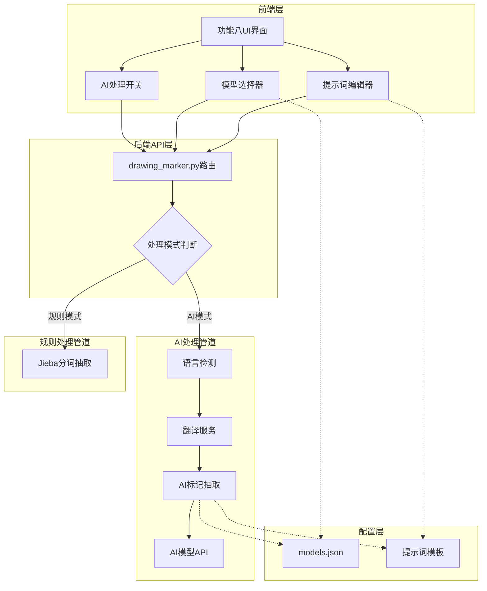
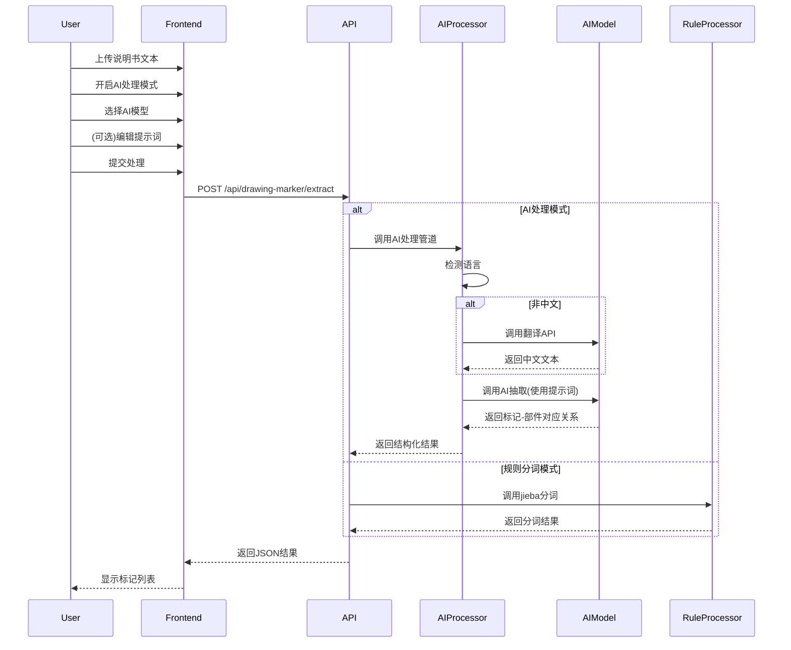

# Design Document: 说明书AI处理器

## Overview

说明书AI处理器为功能八(专利附图标注功能)提供AI驱动的说明书文本处理能力。系统通过可切换的处理模式,允许用户选择使用传统的jieba规则分词或AI模型来抽取专利附图标记和部件名称。

核心设计理念:
- **模式切换**: 无缝切换AI处理和规则分词两种模式
- **可配置性**: 用户可选择AI模型和自定义提示词
- **智能处理**: 自动语言检测、翻译和标记抽取
- **向后兼容**: 保持与现有功能八的完全兼容

## Architecture

### 系统架构图



### 处理流程



## Components and Interfaces

### 1. 前端组件

#### 1.1 AI处理控制面板 (AIProcessingPanel)

**职责**: 提供AI处理模式的用户界面控制

**接口**:
```javascript
class AIProcessingPanel {
  constructor(containerId) {
    this.container = document.getElementById(containerId);
    this.isAIMode = false;
    this.selectedModel = null;
    this.customPrompt = null;
  }
  
  // 渲染控制面板
  render() {
    // 创建开关、模型选择器、提示词编辑器UI
  }
  
  // 切换处理模式
  toggleMode(enabled) {
    this.isAIMode = enabled;
    this.updateUI();
  }
  
  // 加载可用模型列表
  async loadModels() {
    const response = await fetch('/config/models.json');
    return response.json();
  }
  
  // 获取当前配置
  getConfig() {
    return {
      aiMode: this.isAIMode,
      model: this.selectedModel,
      prompt: this.customPrompt
    };
  }
}
```

#### 1.2 提示词编辑器 (PromptEditor)

**职责**: 管理提示词模板和用户自定义提示词

**接口**:
```javascript
class PromptEditor {
  constructor() {
    this.defaultTemplate = null;
    this.customPrompt = null;
  }
  
  // 加载默认模板
  loadDefaultTemplate() {
    this.defaultTemplate = `你是一个专利说明书分析专家。请从以下专利说明书中抽取所有的附图标记及其对应的部件名称。

附图标记通常是数字(如10、20、100)或带图号的标记(如"图1"、"Fig. 1")。

请以JSON格式返回结果:
{
  "components": [
    {"marker": "10", "name": "外壳"},
    {"marker": "20", "name": "显示屏"}
  ]
}

说明书内容:
{description_text}`;
  }
  
  // 获取当前提示词
  getPrompt() {
    return this.customPrompt || this.defaultTemplate;
  }
  
  // 保存自定义提示词
  saveCustomPrompt(prompt) {
    this.customPrompt = prompt;
    localStorage.setItem('customPrompt', prompt);
  }
  
  // 重置为默认模板
  resetToDefault() {
    this.customPrompt = null;
    localStorage.removeItem('customPrompt');
  }
}
```

### 2. 后端组件

#### 2.1 AI处理服务 (AIDescriptionProcessor)

**职责**: 协调AI处理管道的各个步骤

**文件位置**: `backend/services/ai_description_processor.py`

**接口**:
```python
class AIDescriptionProcessor:
    def __init__(self, model_config: dict):
        self.model_config = model_config
        self.language_detector = LanguageDetector()
        self.translator = TranslationService()
        self.extractor = AIComponentExtractor()
    
    async def process(
        self, 
        description_text: str,
        model_name: str,
        custom_prompt: Optional[str] = None
    ) -> dict:
        """
        处理说明书文本并返回结构化结果
        
        Args:
            description_text: 说明书文本
            model_name: AI模型名称
            custom_prompt: 自定义提示词(可选)
        
        Returns:
            {
                "language": "en/zh/ja/...",
                "translated_text": "翻译后的文本(如果需要)",
                "components": [
                    {"marker": "10", "name": "外壳"},
                    ...
                ]
            }
        """
        pass
```

#### 2.2 语言检测器 (LanguageDetector)

**职责**: 检测文本语言类型

**文件位置**: `backend/services/language_detector.py`

**接口**:
```python
class LanguageDetector:
    def detect(self, text: str) -> str:
        """
        检测文本语言
        
        Args:
            text: 输入文本
        
        Returns:
            语言代码: 'zh', 'en', 'ja', 'ko', 'de', 'fr' 等
        """
        pass
    
    def is_chinese(self, text: str) -> bool:
        """判断是否为中文"""
        return self.detect(text) == 'zh'
```

**实现方案**: 使用langdetect库进行语言检测

#### 2.3 翻译服务 (TranslationService)

**职责**: 将非中文文本翻译为中文

**文件位置**: `backend/services/translation_service.py`

**接口**:
```python
class TranslationService:
    def __init__(self, model_config: dict):
        self.model_config = model_config
    
    async def translate_to_chinese(
        self, 
        text: str, 
        source_lang: str,
        model_name: str
    ) -> str:
        """
        翻译文本为中文
        
        Args:
            text: 源文本
            source_lang: 源语言代码
            model_name: 使用的AI模型
        
        Returns:
            翻译后的中文文本
        """
        pass
```

**实现方案**: 调用AI模型API进行翻译,使用专门的翻译提示词

#### 2.4 AI部件抽取器 (AIComponentExtractor)

**职责**: 使用AI模型抽取附图标记和部件名称

**文件位置**: `backend/services/ai_component_extractor.py`

**接口**:
```python
class AIComponentExtractor:
    def __init__(self):
        self.prompt_template = self._load_default_template()
    
    async def extract(
        self,
        description_text: str,
        model_name: str,
        model_config: dict,
        custom_prompt: Optional[str] = None
    ) -> List[dict]:
        """
        从说明书中抽取部件标记
        
        Args:
            description_text: 说明书文本(中文)
            model_name: AI模型名称
            model_config: 模型配置
            custom_prompt: 自定义提示词
        
        Returns:
            [
                {"marker": "10", "name": "外壳"},
                {"marker": "20", "name": "显示屏"},
                ...
            ]
        """
        pass
    
    def _load_default_template(self) -> str:
        """加载默认提示词模板"""
        pass
    
    def _format_prompt(self, template: str, text: str) -> str:
        """格式化提示词"""
        return template.replace('{description_text}', text)
    
    def _parse_ai_response(self, response: str) -> List[dict]:
        """解析AI返回的JSON结果"""
        pass
```

#### 2.5 模式路由器 (ProcessingModeRouter)

**职责**: 根据用户选择路由到AI或规则处理管道

**文件位置**: `backend/routes/drawing_marker.py` (扩展现有路由)

**接口**:
```python
@router.post("/api/drawing-marker/extract")
async def extract_components(request: ComponentExtractionRequest):
    """
    抽取说明书中的部件标记
    
    Request Body:
        {
            "description_text": "说明书内容",
            "ai_mode": true/false,
            "model_name": "GLM-4-Flash" (ai_mode=true时必需),
            "custom_prompt": "自定义提示词" (可选)
        }
    
    Response:
        {
            "success": true,
            "data": {
                "language": "en",
                "translated_text": "...",
                "components": [...]
            }
        }
    """
    if request.ai_mode:
        processor = AIDescriptionProcessor(model_config)
        result = await processor.process(
            request.description_text,
            request.model_name,
            request.custom_prompt
        )
    else:
        # 使用现有的jieba分词逻辑
        from backend.utils.component_extractor import extract_components
        result = extract_components(request.description_text)
    
    return {"success": True, "data": result}
```

### 3. 配置组件

#### 3.1 模型配置

**文件位置**: `config/models.json`

**格式**:
```json
{
  "models": [
    {
      "name": "GLM-4-Flash",
      "provider": "zhipu",
      "api_key_env": "ZHIPU_API_KEY",
      "endpoint": "https://open.bigmodel.cn/api/paas/v4/chat/completions",
      "supports_translation": true,
      "supports_extraction": true
    }
  ]
}
```

#### 3.2 提示词模板

**文件位置**: `backend/templates/prompts/component_extraction.txt`

**默认模板**:
```
你是一个专利说明书分析专家。请从以下专利说明书中抽取所有的附图标记及其对应的部件名称。

附图标记通常是数字(如10、20、100)或带图号的标记(如"图1"、"Fig. 1")。
部件名称是这些标记所指代的具体部件或组件。

要求:
1. 抽取所有出现的附图标记
2. 为每个标记找到对应的部件名称
3. 如果一个标记有多个可能的名称,选择最常见或最准确的一个
4. 忽略纯粹的图号引用(如"如图1所示")

请严格按照以下JSON格式返回结果,不要包含任何其他文字:
{
  "components": [
    {"marker": "标记", "name": "部件名称"},
    ...
  ]
}

说明书内容:
{description_text}
```

## Data Models

### ComponentExtractionRequest

```python
from pydantic import BaseModel
from typing import Optional

class ComponentExtractionRequest(BaseModel):
    description_text: str  # 说明书文本
    ai_mode: bool = False  # 是否使用AI模式
    model_name: Optional[str] = None  # AI模型名称
    custom_prompt: Optional[str] = None  # 自定义提示词
```

### ComponentExtractionResponse

```python
class ComponentExtractionResponse(BaseModel):
    success: bool
    data: Optional[ExtractionResult] = None
    error: Optional[str] = None

class ExtractionResult(BaseModel):
    language: str  # 检测到的语言
    translated_text: Optional[str] = None  # 翻译后的文本(如果进行了翻译)
    components: List[ComponentMapping]  # 标记-部件映射列表
    processing_time: float  # 处理耗时(秒)

class ComponentMapping(BaseModel):
    marker: str  # 附图标记
    name: str  # 部件名称
```

### AIModelConfig

```python
class AIModelConfig(BaseModel):
    name: str  # 模型名称
    provider: str  # 提供商
    api_key_env: str  # API密钥环境变量名
    endpoint: str  # API端点
    supports_translation: bool  # 是否支持翻译
    supports_extraction: bool  # 是否支持抽取
```

## Correctness Properties

*属性是一种特征或行为,应该在系统的所有有效执行中保持为真——本质上是关于系统应该做什么的形式化陈述。属性作为人类可读规范和机器可验证正确性保证之间的桥梁。*


### Property 1: 模式切换状态一致性
*For any* 初始开关状态,点击开关后,系统的处理模式状态应该翻转,且UI显示应该反映新的状态
**Validates: Requirements 1.2, 1.3**

### Property 2: 处理模式路由正确性
*For any* 输入文本,当AI模式关闭时,系统应该调用jieba分词处理;当AI模式开启时,系统应该调用AI处理管道
**Validates: Requirements 1.4, 1.5**

### Property 3: 模型选择器显示完整性
*For any* 从配置文件加载的模型列表,模型选择器中显示的选项数量应该等于配置中的模型数量
**Validates: Requirements 2.3**

### Property 4: 模型选择持久化和使用
*For any* 用户选择的模型,系统应该保存该选择,并在后续处理请求中使用该模型
**Validates: Requirements 2.4, 2.5**

### Property 5: 提示词编辑和应用
*For any* 用户修改的提示词内容,系统应该保存该自定义提示词,并在处理时优先使用自定义提示词而非默认模板
**Validates: Requirements 3.3, 3.4, 3.5**

### Property 6: 语言检测一致性
*For any* 输入文本,系统检测到的语言类型应该与文本的实际主要语言一致
**Validates: Requirements 4.1**

### Property 7: 翻译逻辑正确性
*For any* 输入文本,如果检测为非中文,系统应该调用翻译API;如果检测为中文,系统应该跳过翻译直接处理
**Validates: Requirements 4.3, 4.4**

### Property 8: 响应语言字段存在性
*For any* 处理请求,返回结果应该包含language字段,且该字段值应该与检测到的语言一致
**Validates: Requirements 4.5**

### Property 9: 翻译场景响应格式
*For any* 非中文输入文本,如果进行了翻译,返回结果应该包含translated_text字段
**Validates: Requirements 6.3**

### Property 10: 组件数组结构完整性
*For any* 处理结果,返回的components数组中的每个元素都应该包含marker和name字段,且这两个字段都应该是非空字符串
**Validates: Requirements 5.5, 6.4, 6.5**

### Property 11: JSON响应格式有效性
*For any* 处理请求,系统返回的响应应该是有效的JSON格式,且包含success、data或error字段
**Validates: Requirements 6.1**

### Property 12: 响应结构完整性
*For any* 成功的处理请求,返回的data对象应该包含language字段和components数组字段
**Validates: Requirements 6.2, 6.4**

### Property 13: 错误日志记录
*For any* 处理过程中发生的错误,系统应该记录错误日志,包含错误类型、时间戳和错误详情
**Validates: Requirements 7.5**

### Property 14: 接口兼容性
*For any* 处理结果,无论使用AI模式还是规则模式,返回的数据格式应该保持一致,包含相同的必需字段
**Validates: Requirements 8.1, 8.5**

### Property 15: 进度反馈机制
*For any* 长时间运行的处理任务,系统应该定期发送进度更新,进度值应该在0-100之间且单调递增
**Validates: Requirements 9.4**

## Error Handling

### 错误类型和处理策略

#### 1. AI模型调用错误

**场景**:
- API密钥无效或过期
- API端点不可达
- 模型返回错误响应
- 请求超时

**处理策略**:
```python
try:
    response = await call_ai_model(...)
except APIKeyError:
    return {
        "success": False,
        "error": "AI模型API密钥无效,请检查配置",
        "error_code": "INVALID_API_KEY"
    }
except TimeoutError:
    return {
        "success": False,
        "error": "AI模型调用超时,请稍后重试或使用规则分词模式",
        "error_code": "AI_TIMEOUT"
    }
except Exception as e:
    logger.error(f"AI model call failed: {str(e)}")
    return {
        "success": False,
        "error": f"AI模型调用失败: {str(e)}",
        "error_code": "AI_CALL_FAILED"
    }
```

#### 2. 语言检测错误

**场景**:
- 文本过短无法检测
- 混合语言文本
- 不支持的语言

**处理策略**:
```python
try:
    language = detector.detect(text)
except LangDetectException:
    return {
        "success": False,
        "error": "无法检测文本语言,请确保文本长度足够或手动指定语言",
        "error_code": "LANGUAGE_DETECTION_FAILED",
        "suggestion": "建议使用至少50个字符的文本"
    }
```

#### 3. 翻译服务错误

**场景**:
- 翻译API不可用
- 翻译质量过低
- 不支持的语言对

**处理策略**:
```python
try:
    translated = await translator.translate(text, source_lang)
except TranslationServiceUnavailable:
    return {
        "success": False,
        "error": "翻译服务暂时不可用,建议使用中文说明书或稍后重试",
        "error_code": "TRANSLATION_UNAVAILABLE",
        "suggestion": "如果有中文版本说明书,请直接使用中文版本"
    }
```

#### 4. 抽取结果为空

**场景**:
- 说明书中没有附图标记
- AI未能识别标记
- 文本格式异常

**处理策略**:
```python
if not components or len(components) == 0:
    return {
        "success": True,
        "data": {
            "language": detected_language,
            "components": [],
            "warning": "未能抽取到附图标记,请检查说明书内容或尝试使用规则分词模式"
        }
    }
```

#### 5. JSON解析错误

**场景**:
- AI返回的不是有效JSON
- JSON结构不符合预期

**处理策略**:
```python
try:
    result = json.loads(ai_response)
    if "components" not in result:
        raise ValueError("Missing components field")
except (json.JSONDecodeError, ValueError) as e:
    logger.error(f"Failed to parse AI response: {ai_response}")
    return {
        "success": False,
        "error": "AI返回格式错误,请尝试修改提示词或使用规则分词模式",
        "error_code": "INVALID_AI_RESPONSE"
    }
```

#### 6. 超时处理

**场景**:
- 处理时间超过限制
- 用户取消操作

**处理策略**:
```python
import asyncio

try:
    result = await asyncio.wait_for(
        process_description(text),
        timeout=60.0
    )
except asyncio.TimeoutError:
    return {
        "success": False,
        "error": "处理超时(60秒),建议使用规则分词模式处理长篇说明书",
        "error_code": "PROCESSING_TIMEOUT"
    }
```

### 错误日志格式

所有错误都应该记录到日志系统:

```python
import logging

logger = logging.getLogger("description_ai_processor")

# 错误日志格式
logger.error(
    "AI processing failed",
    extra={
        "error_type": "AI_CALL_FAILED",
        "model_name": model_name,
        "text_length": len(description_text),
        "timestamp": datetime.now().isoformat(),
        "user_id": user_id,
        "error_details": str(exception)
    }
)
```

## Testing Strategy

### 测试方法概述

本功能采用**双重测试策略**:
- **单元测试**: 验证特定示例、边缘情况和错误条件
- **属性测试**: 验证跨所有输入的通用属性

两种测试方法是互补的,共同确保全面覆盖。

### 单元测试策略

单元测试专注于:
- **具体示例**: 演示正确行为的特定案例
- **集成点**: 组件之间的交互
- **边缘情况**: 空输入、特殊字符、极端长度
- **错误条件**: API失败、超时、无效输入

**测试框架**: pytest

**示例单元测试**:

```python
# tests/test_ai_description_processor.py

def test_toggle_switches_mode():
    """测试开关切换功能"""
    panel = AIProcessingPanel()
    assert panel.isAIMode == False
    
    panel.toggleMode(True)
    assert panel.isAIMode == True
    
    panel.toggleMode(False)
    assert panel.isAIMode == False

def test_detect_chinese_language():
    """测试中文语言检测"""
    detector = LanguageDetector()
    text = "本发明涉及一种显示装置"
    assert detector.detect(text) == "zh"

def test_detect_english_language():
    """测试英文语言检测"""
    detector = LanguageDetector()
    text = "The present invention relates to a display device"
    assert detector.detect(text) == "en"

def test_empty_components_handling():
    """测试未抽取到标记的情况"""
    text = "这是一段没有任何附图标记的文本"
    result = await processor.process(text, "GLM-4-Flash")
    assert result["components"] == []
    assert "warning" in result

def test_api_timeout_error():
    """测试API超时错误处理"""
    with patch('asyncio.wait_for', side_effect=asyncio.TimeoutError):
        result = await processor.process(long_text, "GLM-4-Flash")
        assert result["success"] == False
        assert result["error_code"] == "PROCESSING_TIMEOUT"
```

### 属性测试策略

属性测试验证跨所有输入的通用属性,使用随机生成的测试数据。

**测试框架**: Hypothesis (Python属性测试库)

**配置**: 每个属性测试最少运行100次迭代

**标签格式**: 每个测试必须引用设计文档中的属性
```python
# Feature: description-ai-processor, Property 1: 模式切换状态一致性
```

**示例属性测试**:

```python
# tests/test_ai_processor_properties.py

from hypothesis import given, strategies as st

# Feature: description-ai-processor, Property 1: 模式切换状态一致性
@given(initial_state=st.booleans())
def test_toggle_state_consistency(initial_state):
    """
    Property 1: 模式切换状态一致性
    For any 初始开关状态,点击开关后,系统的处理模式状态应该翻转
    """
    panel = AIProcessingPanel()
    panel.isAIMode = initial_state
    
    panel.toggleMode(not initial_state)
    
    assert panel.isAIMode == (not initial_state)
    # 验证UI也更新了
    assert panel.getDisplayedMode() == (not initial_state)

# Feature: description-ai-processor, Property 3: 模型选择器显示完整性
@given(models=st.lists(st.text(min_size=1), min_size=1, max_size=10))
def test_model_selector_completeness(models):
    """
    Property 3: 模型选择器显示完整性
    For any 从配置文件加载的模型列表,选择器显示的选项数量应该等于配置中的模型数量
    """
    # 模拟配置
    config = {"models": [{"name": m} for m in models]}
    
    panel = AIProcessingPanel()
    panel.loadModelsFromConfig(config)
    
    assert len(panel.getModelOptions()) == len(models)

# Feature: description-ai-processor, Property 6: 语言检测一致性
@given(text=st.text(min_size=50, max_size=1000))
def test_language_detection_consistency(text):
    """
    Property 6: 语言检测一致性
    For any 输入文本,系统检测到的语言类型应该与文本的实际主要语言一致
    """
    detector = LanguageDetector()
    detected = detector.detect(text)
    
    # 验证返回的是有效的语言代码
    assert detected in ['zh', 'en', 'ja', 'ko', 'de', 'fr', 'es', 'ru']
    
    # 验证检测结果的一致性(同一文本多次检测应该得到相同结果)
    assert detector.detect(text) == detected

# Feature: description-ai-processor, Property 10: 组件数组结构完整性
@given(
    components=st.lists(
        st.fixed_dictionaries({
            'marker': st.text(min_size=1, max_size=10),
            'name': st.text(min_size=1, max_size=50)
        }),
        min_size=0,
        max_size=20
    )
)
def test_component_array_structure(components):
    """
    Property 10: 组件数组结构完整性
    For any 处理结果,components数组中的每个元素都应该包含marker和name字段
    """
    result = {
        "success": True,
        "data": {
            "language": "zh",
            "components": components
        }
    }
    
    # 验证结构
    for component in result["data"]["components"]:
        assert "marker" in component
        assert "name" in component
        assert isinstance(component["marker"], str)
        assert isinstance(component["name"], str)
        assert len(component["marker"]) > 0
        assert len(component["name"]) > 0

# Feature: description-ai-processor, Property 11: JSON响应格式有效性
@given(
    success=st.booleans(),
    has_data=st.booleans(),
    has_error=st.booleans()
)
def test_json_response_validity(success, has_data, has_error):
    """
    Property 11: JSON响应格式有效性
    For any 处理请求,系统返回的响应应该是有效的JSON格式
    """
    response = build_response(success, has_data, has_error)
    
    # 验证可以序列化为JSON
    json_str = json.dumps(response)
    parsed = json.loads(json_str)
    
    # 验证必需字段
    assert "success" in parsed
    assert isinstance(parsed["success"], bool)
    
    if success:
        assert "data" in parsed
    else:
        assert "error" in parsed

# Feature: description-ai-processor, Property 14: 接口兼容性
@given(
    text=st.text(min_size=10, max_size=500),
    ai_mode=st.booleans()
)
async def test_interface_compatibility(text, ai_mode):
    """
    Property 14: 接口兼容性
    For any 处理结果,无论使用AI模式还是规则模式,返回的数据格式应该保持一致
    """
    if ai_mode:
        result = await ai_processor.process(text, "GLM-4-Flash")
    else:
        result = rule_processor.process(text)
    
    # 验证两种模式返回相同的字段结构
    assert "success" in result
    if result["success"]:
        assert "data" in result
        assert "components" in result["data"]
        assert isinstance(result["data"]["components"], list)
```

### 集成测试

测试完整的端到端流程:

```python
# tests/test_integration.py

async def test_full_ai_processing_pipeline():
    """测试完整的AI处理流程"""
    # 1. 用户开启AI模式
    panel = AIProcessingPanel()
    panel.toggleMode(True)
    
    # 2. 选择模型
    panel.selectModel("GLM-4-Flash")
    
    # 3. 提交英文说明书
    english_text = "The housing 10 includes a display 20..."
    
    # 4. 处理
    result = await processor.process(
        english_text,
        panel.selectedModel,
        panel.getPrompt()
    )
    
    # 5. 验证结果
    assert result["success"] == True
    assert result["data"]["language"] == "en"
    assert "translated_text" in result["data"]
    assert len(result["data"]["components"]) > 0
    
    # 6. 验证标记格式
    for comp in result["data"]["components"]:
        assert "marker" in comp
        assert "name" in comp

async def test_mode_switching_integration():
    """测试模式切换的集成流程"""
    text = "外壳10包括显示屏20"
    
    # AI模式处理
    ai_result = await process_with_mode(text, ai_mode=True, model="GLM-4-Flash")
    
    # 规则模式处理
    rule_result = await process_with_mode(text, ai_mode=False)
    
    # 两种模式都应该返回有效结果
    assert ai_result["success"] == True
    assert rule_result["success"] == True
    
    # 格式应该一致
    assert set(ai_result["data"].keys()) == set(rule_result["data"].keys())
```

### 测试覆盖率目标

- **代码覆盖率**: 最低80%
- **属性测试迭代**: 每个属性最少100次
- **边缘情况覆盖**: 所有已知边缘情况都有对应测试
- **错误路径覆盖**: 所有错误处理分支都有测试

### 测试执行

```bash
# 运行所有测试
pytest tests/

# 运行单元测试
pytest tests/test_ai_description_processor.py

# 运行属性测试
pytest tests/test_ai_processor_properties.py

# 运行集成测试
pytest tests/test_integration.py

# 生成覆盖率报告
pytest --cov=backend/services --cov-report=html
```
