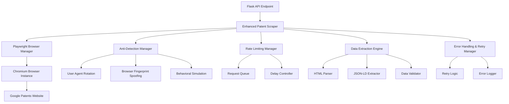

# 设计文档

## 概述

本设计文档描述了Google Patents爬虫增强功能的技术架构和实现方案。该系统将替换现有的基本requests+BeautifulSoup实现，采用现代化的浏览器自动化工具和先进的反反爬虫技术，显著提高批量专利解读功能的数据获取成功率和准确性。

基于研究分析，我们选择Playwright作为主要的爬虫工具，因为它在性能、稳定性和反检测能力方面都优于传统的Selenium。Playwright通过直接的WebSocket连接与浏览器通信，比Selenium的HTTP-WebDriver架构快35-45%，内存消耗更低，并且具有原生的网络拦截能力。

## 架构

### 整体架构



### 核心组件架构

系统采用模块化设计，主要包含以下核心组件：

1. **Enhanced Patent Scraper**: 主控制器，协调各个子模块
2. **Playwright Browser Manager**: 管理浏览器实例的生命周期
3. **Anti-Detection Manager**: 实现反反爬虫策略
4. **Rate Limiting Manager**: 控制请求频率和并发
5. **Data Extraction Engine**: 智能数据提取和解析
6. **Error Handling & Retry Manager**: 错误处理和重试机制

## 组件和接口

### 1. Enhanced Patent Scraper (主控制器)

```python
class EnhancedPatentScraper:
    def __init__(self, config: ScrapingConfig):
        self.browser_manager = PlaywrightBrowserManager(config)
        self.anti_detection = AntiDetectionManager(config)
        self.rate_limiter = RateLimitingManager(config)
        self.data_extractor = DataExtractionEngine()
        self.error_handler = ErrorHandlingManager(config)
    
    async def scrape_patents_batch(self, patent_numbers: List[str]) -> List[PatentResult]:
        """批量爬取专利数据的主入口方法"""
        pass
    
    async def scrape_single_patent(self, patent_number: str) -> PatentResult:
        """单个专利爬取方法"""
        pass
```

### 2. Playwright Browser Manager

```python
class PlaywrightBrowserManager:
    def __init__(self, config: ScrapingConfig):
        self.config = config
        self.browser = None
        self.context = None
        self.page = None
    
    async def initialize_browser(self) -> None:
        """初始化浏览器实例，配置反检测参数"""
        pass
    
    async def create_stealth_context(self) -> BrowserContext:
        """创建具有反检测能力的浏览器上下文"""
        pass
    
    async def get_page(self) -> Page:
        """获取页面实例，应用反检测设置"""
        pass
    
    async def cleanup(self) -> None:
        """清理浏览器资源"""
        pass
```

### 3. Anti-Detection Manager

```python
class AntiDetectionManager:
    def __init__(self, config: ScrapingConfig):
        self.config = config
        self.user_agents = self._load_user_agents()
        self.viewport_sizes = self._load_viewport_sizes()
    
    def get_random_user_agent(self) -> str:
        """获取随机User-Agent"""
        pass
    
    def get_random_viewport(self) -> Dict[str, int]:
        """获取随机视口大小"""
        pass
    
    async def apply_stealth_settings(self, page: Page) -> None:
        """应用反检测设置到页面"""
        pass
    
    async def simulate_human_behavior(self, page: Page) -> None:
        """模拟人类行为模式"""
        pass
```

### 4. Rate Limiting Manager

```python
class RateLimitingManager:
    def __init__(self, config: ScrapingConfig):
        self.config = config
        self.request_queue = asyncio.Queue()
        self.last_request_time = 0
        self.concurrent_limit = config.max_concurrent_requests
    
    async def acquire_request_slot(self) -> None:
        """获取请求槽位，实现速率限制"""
        pass
    
    async def release_request_slot(self) -> None:
        """释放请求槽位"""
        pass
    
    def calculate_delay(self) -> float:
        """计算下次请求的延迟时间"""
        pass
```

### 5. Data Extraction Engine

```python
class DataExtractionEngine:
    def __init__(self):
        self.extractors = [
            JSONLDExtractor(),
            HTMLExtractor(),
            FallbackExtractor()
        ]
    
    async def extract_patent_data(self, page: Page, patent_number: str) -> PatentData:
        """从页面提取专利数据"""
        pass
    
    def validate_patent_data(self, data: PatentData) -> bool:
        """验证提取的数据完整性"""
        pass
    
    def normalize_patent_data(self, data: PatentData) -> PatentData:
        """标准化专利数据格式"""
        pass
```

### 6. Error Handling & Retry Manager

```python
class ErrorHandlingManager:
    def __init__(self, config: ScrapingConfig):
        self.config = config
        self.max_retries = config.max_retries
        self.retry_delays = config.retry_delays
    
    async def execute_with_retry(self, func: Callable, *args, **kwargs) -> Any:
        """带重试机制的函数执行"""
        pass
    
    def should_retry(self, error: Exception) -> bool:
        """判断是否应该重试"""
        pass
    
    def log_error(self, error: Exception, context: Dict) -> None:
        """记录错误信息"""
        pass
```

## 数据模型

### 配置模型

```python
@dataclass
class ScrapingConfig:
    # 浏览器配置
    headless: bool = True
    browser_type: str = "chromium"  # chromium, firefox, webkit
    
    # 反检测配置
    user_agent_rotation: bool = True
    viewport_randomization: bool = True
    javascript_enabled: bool = True
    
    # 速率限制配置
    min_delay: float = 2.0  # 最小延迟（秒）
    max_delay: float = 5.0  # 最大延迟（秒）
    max_concurrent_requests: int = 3  # 最大并发请求数
    
    # 重试配置
    max_retries: int = 3
    retry_delays: List[float] = field(default_factory=lambda: [1.0, 2.0, 4.0])
    
    # 超时配置
    page_timeout: int = 30000  # 页面加载超时（毫秒）
    navigation_timeout: int = 30000  # 导航超时（毫秒）
```

### 专利数据模型

```python
@dataclass
class PatentData:
    patent_number: str
    title: str = ""
    abstract: str = ""
    inventors: List[str] = field(default_factory=list)
    assignees: List[str] = field(default_factory=list)
    application_date: str = ""
    publication_date: str = ""
    claims: List[str] = field(default_factory=list)
    description: str = ""
    url: str = ""
    
    def to_dict(self) -> Dict[str, Any]:
        """转换为字典格式，兼容现有API"""
        return asdict(self)
    
    def is_valid(self) -> bool:
        """检查数据是否有效"""
        return bool(self.patent_number and (self.title or self.abstract))
```

### 结果模型

```python
@dataclass
class PatentResult:
    patent_number: str
    success: bool
    data: Optional[PatentData] = None
    error: Optional[str] = None
    processing_time: float = 0.0
    retry_count: int = 0
    
    def to_dict(self) -> Dict[str, Any]:
        """转换为字典格式，兼容现有API响应"""
        result = {
            'patent_number': self.patent_number,
            'success': self.success,
            'processing_time': self.processing_time,
            'retry_count': self.retry_count
        }
        
        if self.success and self.data:
            result['data'] = self.data.to_dict()
            result['url'] = f"https://patents.google.com/patent/{self.patent_number}"
        else:
            result['error'] = self.error
            
        return result
```

## 错误处理

### 错误分类和处理策略

```python
class ScrapingError(Exception):
    """爬虫基础异常类"""
    pass

class NetworkError(ScrapingError):
    """网络相关错误 - 可重试"""
    pass

class ParsingError(ScrapingError):
    """数据解析错误 - 可重试"""
    pass

class AntiDetectionError(ScrapingError):
    """反爬虫检测错误 - 需要特殊处理"""
    pass

class RateLimitError(ScrapingError):
    """速率限制错误 - 需要延长等待时间"""
    pass

class PatentNotFoundError(ScrapingError):
    """专利不存在错误 - 不可重试"""
    pass
```

### 错误处理流程

1. **网络错误**: 自动重试，增加延迟时间
2. **解析错误**: 尝试备用解析方法，记录详细错误信息
3. **反爬虫检测**: 更换User-Agent，增加延迟，必要时重启浏览器
4. **速率限制**: 动态调整请求间隔，实现指数退避
5. **专利不存在**: 直接标记为失败，不进行重试

## 测试策略

### 单元测试

- **组件隔离测试**: 每个核心组件的独立功能测试
- **模拟测试**: 使用mock对象测试网络交互和浏览器操作
- **数据验证测试**: 测试数据提取和验证逻辑
- **错误处理测试**: 测试各种异常情况的处理

### 集成测试

- **端到端测试**: 完整的专利爬取流程测试
- **批量处理测试**: 测试多专利并发处理能力
- **性能测试**: 测试系统在不同负载下的表现
- **稳定性测试**: 长时间运行测试，验证系统稳定性

### 属性测试配置

- 最小100次迭代每个属性测试
- 每个测试标记格式: **Feature: google-patents-scraper-enhancement, Property {number}: {property_text}**
- 使用Hypothesis库进行属性测试
- 测试数据生成策略覆盖各种专利号格式和边界情况

## 正确性属性

*属性是一个特征或行为，应该在系统的所有有效执行中保持为真——本质上是关于系统应该做什么的正式声明。属性作为人类可读规范和机器可验证正确性保证之间的桥梁。*

基于需求分析和prework分析，以下是系统必须满足的核心正确性属性：

### 属性 1: 现代化工具集成
*对于任何* 系统初始化请求，爬虫系统应该成功实例化Playwright浏览器管理器，并配置适当的反检测选项
**验证: 需求 1.1, 1.2**

### 属性 2: JavaScript动态内容支持  
*对于任何* 需要JavaScript渲染的专利页面，系统应该能够正确获取动态加载的内容
**验证: 需求 1.3**

### 属性 3: 反爬虫策略应用
*对于任何* 检测到反爬虫机制的情况，系统应该自动应用相应的绕过策略（User-Agent轮换、代理切换等）
**验证: 需求 1.4, 3.1, 3.3**

### 属性 4: 完整数据提取
*对于任何* 有效的专利页面，数据提取引擎应该成功提取所有可用的核心字段（标题、摘要、发明人、权利要求、说明书等）
**验证: 需求 2.1, 2.2, 2.3**

### 属性 5: 多布局适应性
*对于任何* 不同HTML结构的专利页面，系统应该能够适应并正确提取数据
**验证: 需求 2.4**

### 属性 6: 数据缺失处理
*对于任何* 包含缺失字段的专利页面，系统应该正确标记缺失字段并继续处理其他可用数据
**验证: 需求 2.5**

### 属性 7: 速率限制遵守
*对于任何* 连续的请求序列，系统应该在请求间添加适当的随机延迟，并限制并发请求数量
**验证: 需求 3.2, 5.2**

### 属性 8: 会话管理
*对于任何* 会话过期的情况，系统应该自动重新建立连接并继续处理
**验证: 需求 3.5**

### 属性 9: 验证码处理
*对于任何* 遇到验证码的情况，系统应该记录错误并跳过该专利，不中断整体流程
**验证: 需求 3.4**

### 属性 10: 统一重试机制
*对于任何* 可重试的错误（网络错误、超时、HTTP错误），系统应该执行最多3次重试，并在达到上限时标记为失败
**验证: 需求 4.1, 4.2, 4.3, 4.5**

### 属性 11: 错误隔离处理
*对于任何* 数据解析失败或单个专利处理失败的情况，系统应该记录详细错误信息并继续处理其他专利
**验证: 需求 4.4, 5.4**

### 属性 12: 批量处理能力
*对于任何* 不超过50个专利号的批量请求，系统应该能够成功处理并提供实时进度反馈
**验证: 需求 5.1, 5.3**

### 属性 13: 批量处理统计
*对于任何* 批量处理完成的情况，系统应该提供详细的成功/失败统计信息
**验证: 需求 5.5**

### 属性 14: 数据质量保证
*对于任何* 提取的专利数据，系统应该执行必需字段验证、格式标准化、Unicode编码处理，并为空数据提供默认值
**验证: 需求 6.1, 6.2, 6.3, 6.4**

### 属性 15: API兼容性
*对于任何* 返回的数据结构，应该与现有API接口完全兼容
**验证: 需求 6.5**

### 属性 16: 综合日志记录
*对于任何* 系统操作，应该记录详细的操作日志、错误信息、性能指标，并实现日志轮转机制
**验证: 需求 7.1, 7.2, 7.3, 7.4, 7.5**

### 属性 17: 配置管理
*对于任何* 系统启动和运行时配置变更，系统应该正确加载和应用配置参数（延迟、浏览器选项、重试策略等）
**验证: 需求 8.1, 8.2, 8.3, 8.4, 8.5**