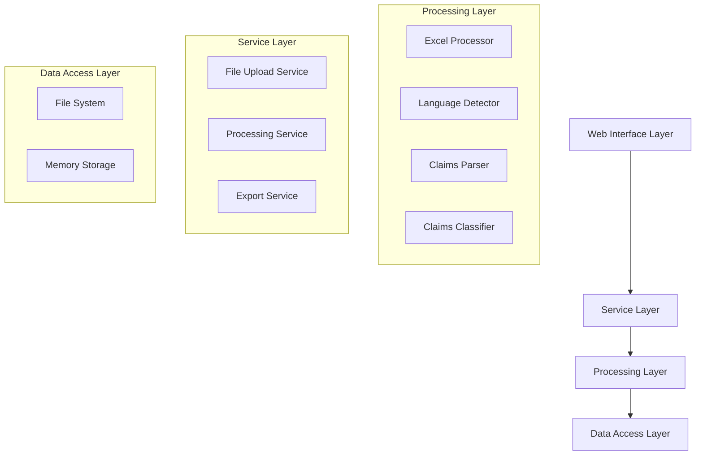

# 设计文档

## 概述

专利权利要求处理系统是一个基于Python的文本处理应用，专门用于解析Excel文件中的多语言专利权利要求文本。系统采用模块化架构，结合了Excel文件处理、多语言检测、文本解析和结构化数据输出等功能。

核心设计原则：
- **多语言支持**：自动检测和处理英文、中文及其他语言的权利要求
- **智能解析**：基于序号连续性和关键词识别进行权利要求分类
- **容错处理**：对格式不规范的文本提供最大程度的兼容性
- **结构化输出**：提供清晰的数据结构和多种导出格式

## 架构

系统采用分层架构设计，包含以下主要层次：



### 架构层次说明

1. **Web Interface Layer（Web接口层）**
   - 处理用户文件上传
   - 提供处理进度反馈
   - 展示处理结果和导出功能

2. **Service Layer（服务层）**
   - 文件上传服务：验证和存储Excel文件
   - 处理服务：协调各个处理组件
   - 导出服务：生成结构化输出文件

3. **Processing Layer（处理层）**
   - Excel处理器：读取和解析Excel文件
   - 语言检测器：识别文本语言并选择优先版本
   - 权利要求解析器：提取权利要求序号和文本
   - 权利要求分类器：区分独立权利要求和从属权利要求

4. **Data Access Layer（数据访问层）**
   - 文件系统：存储上传的Excel文件和输出结果
   - 内存存储：缓存处理过程中的中间数据

## 组件和接口

### 核心组件

#### 1. ExcelProcessor（Excel处理器）

```python
class ExcelProcessor:
    def read_excel_file(self, file_path: str, sheet_name: str = None) -> pd.DataFrame
    def get_sheet_names(self, file_path: str) -> List[str]
    def get_column_data(self, df: pd.DataFrame, column_name: str) -> List[str]
    def validate_excel_file(self, file_path: str) -> bool
```

**职责**：
- 读取和验证Excel文件
- 提供工作表和列选择功能
- 处理Excel文件格式异常

#### 2. LanguageDetector（语言检测器）

```python
class LanguageDetector:
    def detect_language(self, text: str) -> str
    def select_preferred_version(self, text_segments: List[str]) -> str
    def identify_language_boundaries(self, text: str) -> List[Tuple[int, int, str]]
    def get_language_priority_score(self, language: str) -> int
```

**职责**：
- 检测文本语言类型
- 根据优先级选择语言版本（英文 > 中文 > 其他）
- 识别多语言文本的边界

#### 3. ClaimsParser（权利要求解析器）

```python
class ClaimsParser:
    def extract_claim_numbers(self, text: str) -> List[int]
    def split_claims_by_numbers(self, text: str) -> Dict[int, str]
    def detect_sequence_restart(self, claim_numbers: List[int]) -> List[int]
    def normalize_claim_text(self, text: str) -> str
```

**职责**：
- 提取权利要求序号
- 按序号分割权利要求文本
- 检测序号重新开始（新语言版本标志）
- 标准化权利要求文本格式

#### 4. ClaimsClassifier（权利要求分类器）

```python
class ClaimsClassifier:
    def classify_claim_type(self, claim_text: str, language: str) -> str
    def extract_referenced_claims(self, claim_text: str, language: str) -> List[int]
    def get_reference_keywords(self, language: str) -> List[str]
    def validate_claim_dependencies(self, claims: Dict[int, ClaimInfo]) -> List[str]
```

**职责**：
- 识别独立权利要求和从属权利要求
- 提取从属权利要求引用的序号
- 支持多语言关键词识别
- 验证权利要求依赖关系

#### 5. ProcessingService（处理服务）

```python
class ProcessingService:
    def process_excel_file(self, file_path: str, column_name: str) -> ProcessingResult
    def process_single_cell(self, cell_text: str) -> List[ClaimInfo]
    def generate_processing_report(self, results: List[ProcessingResult]) -> ProcessingReport
    def validate_processing_results(self, results: List[ClaimInfo]) -> List[ValidationError]
```

**职责**：
- 协调整个处理流程
- 处理单个单元格的权利要求文本
- 生成处理报告和验证结果

### 接口定义

#### ClaimInfo数据结构

```python
@dataclass
class ClaimInfo:
    claim_number: int
    claim_type: str  # "independent" or "dependent"
    claim_text: str
    language: str
    referenced_claims: List[int]
    original_text: str
    confidence_score: float
```

#### ProcessingResult数据结构

```python
@dataclass
class ProcessingResult:
    cell_index: int
    claims: List[ClaimInfo]
    selected_language: str
    processing_errors: List[str]
    processing_time: float
```

## 数据模型

### 输入数据模型

```python
class ExcelInputData:
    file_path: str
    sheet_name: str
    column_name: str
    start_row: int = 1
    end_row: Optional[int] = None
```

### 输出数据模型

```python
class ProcessedClaims:
    total_cells_processed: int
    total_claims_extracted: int
    language_distribution: Dict[str, int]
    independent_claims_count: int
    dependent_claims_count: int
    processing_errors: List[ProcessingError]
    claims_data: List[ClaimInfo]
```

### 错误处理模型

```python
class ProcessingError:
    error_type: str
    cell_index: int
    error_message: str
    suggested_action: str
    severity: str  # "warning", "error", "critical"
```

## 正确性属性

*属性是应该在系统的所有有效执行中保持为真的特征或行为——本质上是关于系统应该做什么的正式陈述。属性作为人类可读规范和机器可验证正确性保证之间的桥梁。*

基于需求分析和属性反思，以下是系统的核心正确性属性：

### 属性 1: Excel文件验证和处理
*对于任何* 上传的文件，如果文件是有效的Excel格式，系统应当成功读取并返回文件内容；如果文件格式无效，系统应当返回明确的错误信息而不是崩溃
**验证需求: 1.1, 1.4**

### 属性 2: 工作表和列选择功能
*对于任何* 包含多个工作表或多列的Excel文件，系统应当正确列出所有可用选项并允许用户成功选择指定的工作表和列
**验证需求: 1.2, 1.3**

### 属性 3: 多语言版本识别和优先级选择
*对于任何* 包含多种语言版本的权利要求文本，系统应当通过序号连续性正确识别语言边界，并按照优先级（英文 > 中文 > 其他语言）选择处理版本
**验证需求: 2.1, 2.2, 2.4**

### 属性 4: 序号格式适应性
*对于任何* 权利要求文本，无论序号格式如何变化（不同语言、不同格式），系统应当正确识别和提取所有权利要求序号
**验证需求: 2.3, 4.1, 4.4**

### 属性 5: 权利要求文本分割和提取
*对于任何* 包含连续序号的权利要求文本，系统应当正确分割每个权利要求的内容并提取完整的文本信息
**验证需求: 3.1, 3.2**

### 属性 6: 序号重启检测
*对于任何* 权利要求文本，当序号重新从1开始时，系统应当正确识别为新语言版本的开始并相应处理
**验证需求: 4.2**

### 属性 7: 权利要求类型分类
*对于任何* 权利要求文本，系统应当根据是否包含引用关键词（"权利要求"、"claim"等）正确分类为独立权利要求或从属权利要求
**验证需求: 5.1, 5.2**

### 属性 8: 引用关系提取
*对于任何* 从属权利要求，系统应当正确提取其引用的权利要求序号，支持多语言格式
**验证需求: 5.3**

### 属性 9: 结构化输出完整性
*对于任何* 处理完成的结果，输出数据应当包含所有必需字段（序号、类型、引用关系、原始文本、语言标识）并保持结构完整性
**验证需求: 6.1, 6.2**

### 属性 10: 导出功能正确性
*对于任何* 处理结果，系统应当支持导出为Excel和JSON格式，并在导出文件中正确标明处理的语言版本
**验证需求: 6.3**

### 属性 11: 容错处理能力
*对于任何* 包含格式不规范或解析失败的数据，系统应当尽可能提取有效内容，跳过无效数据，并记录详细的错误信息和处理状态
**验证需求: 3.3, 3.4, 7.2**

### 属性 12: 错误报告质量
*对于任何* 处理过程中的错误，系统应当生成包含具体错误信息、修正建议和处理统计的详细报告
**验证需求: 6.4, 7.1**

### 属性 13: 中断恢复功能
*对于任何* 被中断的处理过程，系统应当保存已处理的结果并允许用户恢复处理
**验证需求: 7.4**

<function_calls>
<invoke name="prework">
<parameter name="featureName">patent-claims-processor

## 错误处理

### 错误分类

系统采用分层错误处理策略，将错误分为以下类别：

#### 1. 输入验证错误
- **文件格式错误**：非Excel格式文件
- **文件损坏错误**：Excel文件结构损坏
- **权限错误**：文件无法读取
- **大小限制错误**：文件超过处理限制

#### 2. 数据处理错误
- **语言检测失败**：无法确定文本语言
- **序号提取失败**：无法识别权利要求序号
- **文本分割错误**：权利要求文本格式异常
- **分类歧义**：无法确定权利要求类型

#### 3. 系统错误
- **内存不足**：处理大文件时资源不足
- **处理超时**：单个文件处理时间过长
- **存储错误**：结果保存失败

### 错误处理策略

```python
class ErrorHandler:
    def handle_file_error(self, error: FileError) -> ErrorResponse:
        """处理文件相关错误，提供具体的修正建议"""
        
    def handle_processing_error(self, error: ProcessingError) -> ErrorResponse:
        """处理数据处理错误，尝试容错处理"""
        
    def handle_system_error(self, error: SystemError) -> ErrorResponse:
        """处理系统错误，提供恢复机制"""
```

### 容错机制

1. **渐进式处理**：单个单元格处理失败不影响其他单元格
2. **部分结果保存**：处理中断时保存已完成的结果
3. **智能重试**：对临时性错误进行自动重试
4. **用户反馈**：提供详细的错误信息和修正建议

## 测试策略

### 双重测试方法

系统采用单元测试和基于属性的测试相结合的策略：

#### 单元测试
- **具体示例验证**：测试特定的输入输出场景
- **边界条件测试**：测试极端情况和边界值
- **错误条件测试**：验证错误处理的正确性
- **集成点测试**：验证组件间的交互

#### 基于属性的测试
- **通用属性验证**：验证所有输入都满足的通用属性
- **随机输入覆盖**：通过随机生成的输入测试系统鲁棒性
- **最少100次迭代**：每个属性测试运行至少100次随机测试
- **属性标记格式**：**Feature: patent-claims-processor, Property {number}: {property_text}**

### 测试框架选择

**推荐使用Python的Hypothesis库进行基于属性的测试**：
- 强大的随机数据生成能力
- 自动缩小失败案例
- 与pytest良好集成
- 支持复杂数据结构生成

### 测试数据生成策略

#### 智能生成器设计
```python
@given(
    excel_data=excel_file_strategy(),
    claims_text=multilingual_claims_strategy(),
    language_mix=language_combination_strategy()
)
def test_multilingual_processing_property(excel_data, claims_text, language_mix):
    """测试多语言处理属性"""
```

#### 生成器约束
- **Excel文件生成器**：生成各种格式和结构的Excel文件
- **权利要求文本生成器**：生成符合专利格式的多语言文本
- **序号格式生成器**：生成不同语言和格式的序号模式
- **错误数据生成器**：生成各种异常和边界情况

### 测试覆盖目标

1. **功能覆盖**：所有核心功能都有对应的测试
2. **属性覆盖**：每个正确性属性都有专门的基于属性的测试
3. **错误覆盖**：所有错误处理路径都被测试
4. **性能覆盖**：关键性能指标有基准测试

### 持续验证

- **回归测试**：每次代码变更后运行完整测试套件
- **性能监控**：跟踪处理时间和内存使用
- **错误率监控**：监控生产环境中的错误发生率
- **用户反馈集成**：将用户报告的问题转化为测试用例