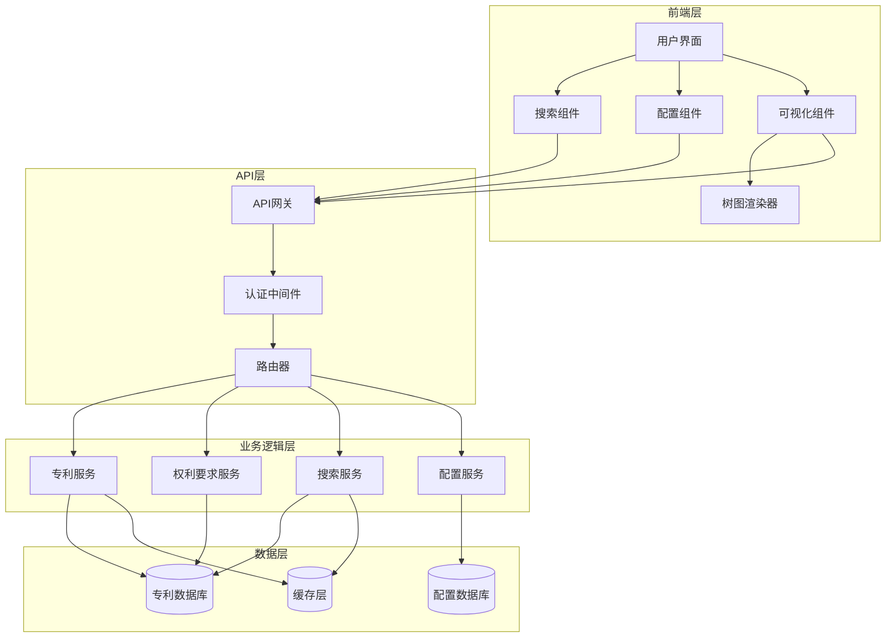

# 设计文档

## 概述

专利号查询和权利要求引用关系树图可视化功能是一个集成的Web应用程序功能，允许用户通过专利号搜索已分析的专利数据，并以交互式树图形式可视化展示权利要求之间的依赖关系。该系统采用前后端分离架构，前端使用D3.js进行数据可视化，后端提供RESTful API支持数据查询和处理。

## 架构

### 系统架构图



### 技术栈

**前端技术栈:**
- HTML5/CSS3/JavaScript ES6+
- D3.js v7+ (数据可视化)
- 响应式CSS框架 (Bootstrap或自定义)
- Webpack (模块打包)

**后端技术栈:**
- Python Flask/FastAPI 或 Node.js Express
- SQLAlchemy/Prisma (ORM)
- Redis (缓存)
- PostgreSQL/MySQL (数据库)

## 组件和接口

### 前端组件

#### 1. PatentSearchComponent
**职责:** 处理专利号搜索功能
**接口:**
```javascript
class PatentSearchComponent {
    constructor(apiClient, eventBus)
    
    // 搜索专利号
    async searchPatents(query: string): Promise<PatentSearchResult[]>
    
    // 获取专利详情
    async getPatentDetails(patentNumber: string): Promise<PatentDetails>
    
    // 清空搜索结果
    clearResults(): void
    
    // 事件处理
    onPatentSelected(callback: Function): void
}

interface PatentSearchResult {
    patentNumber: string
    title: string
    applicant: string
    filingDate: string
    claimsCount: number
}

interface PatentDetails {
    patentNumber: string
    title: string
    applicant: string
    filingDate: string
    claims: ClaimData[]
    claimsTree: ClaimsTreeData
}
```

#### 2. ConfigurationComponent
**职责:** 管理专利号列配置
**接口:**
```javascript
class ConfigurationComponent {
    constructor(apiClient)
    
    // 获取当前配置
    async getConfiguration(): Promise<ColumnConfiguration>
    
    // 保存配置
    async saveConfiguration(config: ColumnConfiguration): Promise<boolean>
    
    // 验证配置
    validateConfiguration(config: ColumnConfiguration): ValidationResult
}

interface ColumnConfiguration {
    patentNumberColumn: string
    excelFilePath: string
    columnIndex: number
    headerRow: number
}

interface ValidationResult {
    isValid: boolean
    errors: string[]
}
```

#### 3. ClaimsVisualizationComponent
**职责:** 权利要求可视化管理
**接口:**
```javascript
class ClaimsVisualizationComponent {
    constructor(d3Container, options)
    
    // 渲染权利要求树图
    renderClaimsTree(claimsData: ClaimsTreeData, style: VisualizationStyle): void
    
    // 更新可视化样式
    updateVisualizationStyle(style: VisualizationStyle): void
    
    // 处理节点交互
    onNodeClick(callback: Function): void
    onNodeHover(callback: Function): void
    
    // 缩放和平移控制
    enableZoomPan(): void
    resetView(): void
}

interface ClaimsTreeData {
    nodes: ClaimNode[]
    links: ClaimLink[]
    rootNodes: string[]
}

interface ClaimNode {
    id: string
    claimNumber: number
    claimText: string
    claimType: 'independent' | 'dependent'
    level: number
    dependencies: string[]
}

interface ClaimLink {
    source: string
    target: string
    type: 'dependency'
}

enum VisualizationStyle {
    TREE = 'tree',
    NETWORK = 'network',
    RADIAL = 'radial'
}
```

#### 4. D3TreeRenderer
**职责:** D3.js树图渲染引擎
**接口:**
```javascript
class D3TreeRenderer {
    constructor(svgElement, options)
    
    // 渲染树状图
    renderTree(data: ClaimsTreeData): void
    
    // 渲染网络图
    renderNetwork(data: ClaimsTreeData): void
    
    // 渲染径向图
    renderRadial(data: ClaimsTreeData): void
    
    // 添加交互功能
    addInteractivity(): void
    
    // 动画过渡
    animateTransition(duration: number): void
    
    // 响应式调整
    resize(): void
}
```

### 后端API接口

#### 1. Patent Search API
```python
# GET /api/patents/search?q={query}&limit={limit}
class PatentSearchAPI:
    def search_patents(query: str, limit: int = 10) -> List[PatentSearchResult]:
        """搜索专利号，支持模糊匹配"""
        pass
    
    def get_patent_details(patent_number: str) -> PatentDetails:
        """获取专利详细信息和权利要求数据"""
        pass
```

#### 2. Claims Analysis API
```python
# GET /api/claims/{patent_number}
class ClaimsAnalysisAPI:
    def get_claims_tree(patent_number: str) -> ClaimsTreeData:
        """获取权利要求依赖关系树数据"""
        pass
    
    def analyze_claim_dependencies(claims: List[str]) -> ClaimsTreeData:
        """分析权利要求依赖关系"""
        pass
```

#### 3. Configuration API
```python
# GET/POST /api/configuration
class ConfigurationAPI:
    def get_configuration() -> ColumnConfiguration:
        """获取当前列配置"""
        pass
    
    def save_configuration(config: ColumnConfiguration) -> bool:
        """保存列配置"""
        pass
```

### 业务逻辑服务

#### 1. PatentSearchService
**职责:** 专利搜索业务逻辑
```python
class PatentSearchService:
    def __init__(self, db_client, cache_client):
        self.db = db_client
        self.cache = cache_client
    
    def fuzzy_search(self, query: str) -> List[PatentSearchResult]:
        """模糊搜索专利号"""
        # 实现模糊匹配算法
        # 支持部分匹配和相似度排序
        pass
    
    def exact_search(self, patent_number: str) -> PatentDetails:
        """精确搜索专利详情"""
        # 从缓存或数据库获取专利详情
        pass
```

#### 2. ClaimsDependencyAnalyzer
**职责:** 权利要求依赖关系分析
```python
class ClaimsDependencyAnalyzer:
    def analyze_dependencies(self, claims: List[str]) -> ClaimsTreeData:
        """分析权利要求依赖关系"""
        # 解析权利要求文本
        # 识别依赖关系
        # 构建树状数据结构
        pass
    
    def parse_claim_references(self, claim_text: str) -> List[int]:
        """解析权利要求引用"""
        # 使用正则表达式识别引用的权利要求编号
        pass
    
    def build_dependency_tree(self, dependencies: Dict) -> ClaimsTreeData:
        """构建依赖关系树"""
        # 将依赖关系转换为树状数据结构
        pass
```

## 数据模型

### 数据库模型

#### Patents表
```sql
CREATE TABLE patents (
    id SERIAL PRIMARY KEY,
    patent_number VARCHAR(50) UNIQUE NOT NULL,
    title TEXT NOT NULL,
    applicant VARCHAR(255),
    filing_date DATE,
    publication_date DATE,
    claims_data JSONB,
    created_at TIMESTAMP DEFAULT CURRENT_TIMESTAMP,
    updated_at TIMESTAMP DEFAULT CURRENT_TIMESTAMP
);

CREATE INDEX idx_patents_number ON patents(patent_number);
CREATE INDEX idx_patents_applicant ON patents(applicant);
CREATE INDEX idx_patents_filing_date ON patents(filing_date);
```

#### Claims表
```sql
CREATE TABLE claims (
    id SERIAL PRIMARY KEY,
    patent_id INTEGER REFERENCES patents(id),
    claim_number INTEGER NOT NULL,
    claim_text TEXT NOT NULL,
    claim_type VARCHAR(20) NOT NULL, -- 'independent' or 'dependent'
    dependencies INTEGER[], -- 依赖的权利要求编号数组
    level INTEGER DEFAULT 0, -- 依赖层级
    created_at TIMESTAMP DEFAULT CURRENT_TIMESTAMP
);

CREATE INDEX idx_claims_patent_id ON claims(patent_id);
CREATE INDEX idx_claims_number ON claims(claim_number);
CREATE INDEX idx_claims_type ON claims(claim_type);
```

#### Configuration表
```sql
CREATE TABLE configuration (
    id SERIAL PRIMARY KEY,
    config_key VARCHAR(100) UNIQUE NOT NULL,
    config_value JSONB NOT NULL,
    description TEXT,
    created_at TIMESTAMP DEFAULT CURRENT_TIMESTAMP,
    updated_at TIMESTAMP DEFAULT CURRENT_TIMESTAMP
);
```

### 数据传输对象

#### ClaimsTreeData
```typescript
interface ClaimsTreeData {
    patentNumber: string
    nodes: ClaimNode[]
    links: ClaimLink[]
    rootNodes: string[] // 独立权利要求ID列表
    metadata: {
        totalClaims: number
        independentClaims: number
        dependentClaims: number
        maxDepth: number
    }
}

interface ClaimNode {
    id: string // 格式: "claim_{claim_number}"
    claimNumber: number
    claimText: string
    claimType: 'independent' | 'dependent'
    level: number // 依赖层级，独立权利要求为0
    dependencies: number[] // 直接依赖的权利要求编号
    children: string[] // 子节点ID列表
    x?: number // D3.js布局坐标
    y?: number
}

interface ClaimLink {
    source: string // 源节点ID
    target: string // 目标节点ID
    type: 'dependency'
    strength?: number // 连接强度
}
```

## 错误处理

### 错误类型定义

```typescript
enum ErrorType {
    PATENT_NOT_FOUND = 'PATENT_NOT_FOUND',
    INVALID_PATENT_NUMBER = 'INVALID_PATENT_NUMBER',
    SEARCH_TIMEOUT = 'SEARCH_TIMEOUT',
    VISUALIZATION_ERROR = 'VISUALIZATION_ERROR',
    CONFIGURATION_ERROR = 'CONFIGURATION_ERROR',
    DATABASE_ERROR = 'DATABASE_ERROR',
    NETWORK_ERROR = 'NETWORK_ERROR'
}

interface ApiError {
    type: ErrorType
    message: string
    details?: any
    timestamp: string
    requestId: string
}
```

### 错误处理策略

1. **前端错误处理:**
   - 网络错误：显示重试按钮和错误提示
   - 数据错误：显示友好的错误消息
   - 可视化错误：回退到简单的列表视图

2. **后端错误处理:**
   - 数据库连接错误：返回503状态码
   - 数据不存在：返回404状态码
   - 参数验证错误：返回400状态码
   - 服务器内部错误：返回500状态码并记录日志

3. **用户体验优化:**
   - 加载状态指示器
   - 错误消息本地化
   - 优雅降级机制

## 测试策略

### 单元测试

**前端单元测试:**
- 组件功能测试
- D3.js渲染逻辑测试
- 用户交互事件测试
- 响应式布局测试

**后端单元测试:**
- API端点测试
- 业务逻辑测试
- 数据库操作测试
- 权利要求解析算法测试

### 集成测试

- 前后端API集成测试
- 数据库集成测试
- 缓存集成测试
- 第三方服务集成测试

### 端到端测试

- 完整用户流程测试
- 跨浏览器兼容性测试
- 移动端响应式测试
- 性能测试

### 性能测试

- API响应时间测试（目标：<500ms）
- 大数据集可视化性能测试
- 并发用户负载测试
- 内存使用优化测试

## 正确性属性

*属性是一个特征或行为，应该在系统的所有有效执行中保持为真——本质上，是关于系统应该做什么的正式陈述。属性作为人类可读规范和机器可验证正确性保证之间的桥梁。*

### 属性 1: 配置管理一致性
*对于任何*有效的列配置数据，保存配置后立即检索应该返回相同的配置信息，并且系统应该应用新配置进行后续操作
**验证: 需求 1.2, 1.3, 1.4**

### 属性 2: 搜索结果准确性
*对于任何*专利号搜索查询，返回的结果应该包含所有匹配查询条件的专利，并且结果应该按相关性排序
**验证: 需求 2.1, 2.2**

### 属性 3: 专利详情完整性
*对于任何*有效的专利号，加载的专利详情应该包含完整的权利要求文本和所有相关的元数据信息
**验证: 需求 3.1, 3.2**

### 属性 4: 引用关系识别准确性
*对于任何*包含引用关系的权利要求文本，系统应该正确识别并标识所有引用的权利要求编号
**验证: 需求 3.3**

### 属性 5: 树图生成正确性
*对于任何*权利要求数据集，生成的树状数据结构应该准确反映权利要求之间的依赖关系，并且可以成功渲染为交互式树图
**验证: 需求 4.1, 4.2, 4.3**

### 属性 6: 节点层级关系正确性
*对于任何*权利要求树，独立权利要求应该作为根节点，从属权利要求应该正确连接到其依赖的父权利要求
**验证: 需求 4.4, 4.5**

### 属性 7: 节点交互响应性
*对于任何*树图节点，用户的点击和悬停操作应该触发相应的信息显示，并且显示的内容应该与节点对应的权利要求一致
**验证: 需求 5.1, 5.2**

### 属性 8: 树图操作功能性
*对于任何*超出显示区域的树图，缩放和平移操作应该正确调整视图，拖拽操作应该更新节点位置
**验证: 需求 5.3, 5.4**

### 属性 9: 节点展开折叠一致性
*对于任何*具有子节点的节点，展开操作应该显示所有子节点，折叠操作应该隐藏所有子节点，并且操作应该是可逆的
**验证: 需求 5.5**

### 属性 10: 可视化样式切换保持数据一致性
*对于任何*权利要求数据，在不同可视化样式（树状图、网络图）之间切换时，显示的数据内容和关系应该保持一致
**验证: 需求 6.2, 6.3, 6.4**

### 属性 11: 用户偏好持久化
*对于任何*用户的样式偏好设置，保存后在后续会话中应该能够正确恢复相同的设置
**验证: 需求 6.5**

### 属性 12: 响应式布局适配性
*对于任何*屏幕尺寸变化，界面元素应该自动调整大小和位置以保持可用性和可读性
**验证: 需求 7.1, 7.2, 7.3**

### 属性 13: 触摸交互兼容性
*对于任何*触摸设备，触摸操作应该与鼠标操作产生相同的交互效果
**验证: 需求 7.4**

### 属性 14: 加载状态反馈一致性
*对于任何*数据加载或处理操作，系统应该显示适当的加载指示器，并在操作完成后及时移除
**验证: 需求 7.5**

### 属性 15: API性能和数据完整性
*对于任何*有效的API请求，系统应该在指定时间内返回完整和正确的数据，或者返回标准化的错误响应
**验证: 需求 8.1, 8.2, 8.3**

### 属性 16: 系统负载处理能力
*对于任何*超出系统负载的并发请求，系统应该实施适当的限流措施并返回合理的响应，而不是崩溃
**验证: 需求 8.4, 8.5**