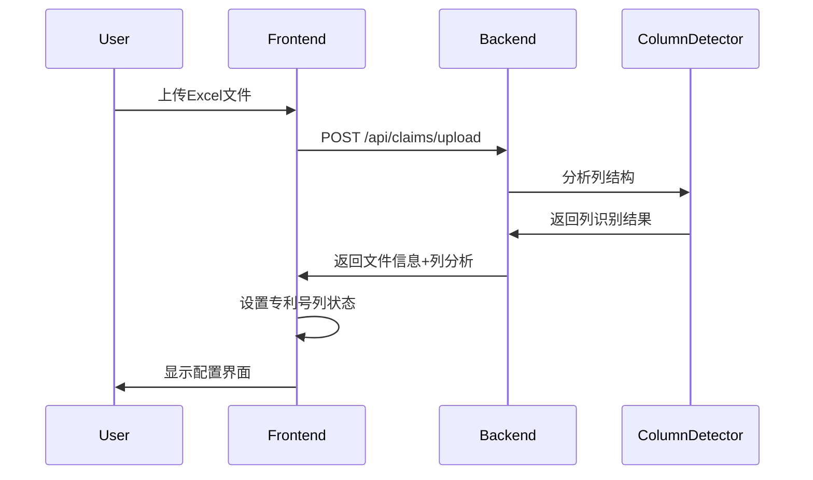
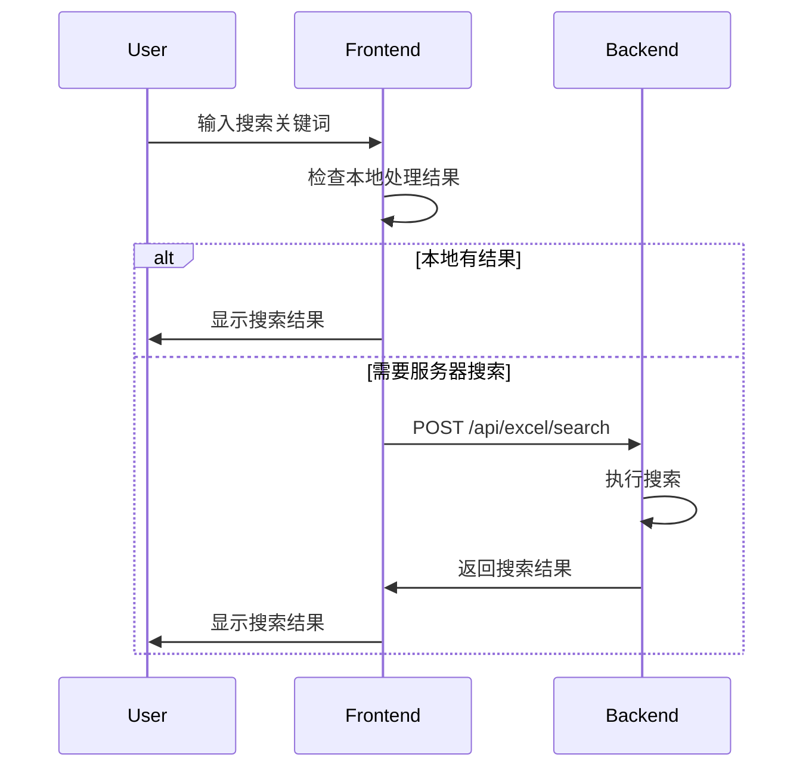

# 功能七专利号搜索修复设计文档

## 设计概述

本设计旨在修复功能七中专利号搜索功能的问题，通过改进列识别算法、增加手动配置选项和优化搜索逻辑来提升用户体验。

## 架构设计

### 组件架构
```
前端层 (Frontend)
├── 文件上传组件 (File Upload)
├── 列选择组件 (Column Selection) [新增/增强]
├── 专利搜索组件 (Patent Search) [修复]
└── 结果展示组件 (Results Display)

后端层 (Backend)
├── 列识别服务 (Column Detection) [增强]
├── 专利搜索服务 (Patent Search) [修复]
└── Excel处理服务 (Excel Processing)

数据层 (Data)
├── 上传文件存储
├── 处理结果缓存
└── 用户配置存储 [新增]
```

## 核心修复方案

### 1. 专利号格式识别增强

#### 当前问题
```python
# 当前正则表达式过于严格
r'CN\d{9}[A-Z]?'  # 只匹配9位数字
r'US\d{7,10}[A-Z]?\d?'  # 位数限制严格
```

#### 修复方案
```python
# 更宽松的专利号识别
self.patent_number_patterns = [
    # 中国专利号 - 支持更多位数
    r'CN\d{8,15}[A-Z]?\d?',  # 8-15位数字
    r'ZL\d{8,15}\.?\d?',     # 支持可选小数点
    r'\d{4}\d{6,12}\.?\d?',  # 年份+6-12位数字
    
    # 美国专利号 - 支持更长格式
    r'US\d{6,15}[A-Z]?\d?',  # 6-15位数字
    r'\d{6,15}',             # 纯数字格式
    
    # 通用格式 - 更宽松匹配
    r'[A-Z]{2,4}\d{6,20}[A-Z]?\d?',  # 2-4字母+6-20数字
    r'\d{6,20}[A-Z]?\d?',            # 6-20位数字+可选字母
    
    # 特殊格式支持
    r'[A-Z0-9]{8,25}',               # 8-25位字母数字组合
]
```

### 2. 智能列识别改进

#### 新增评分机制
```python
def enhanced_detect_patent_column(self, df: pd.DataFrame) -> Dict:
    """增强的专利号列检测"""
    results = []
    
    for col_name in df.columns:
        score = 0
        reasons = []
        
        # 1. 列名匹配 (权重40%)
        name_score = self.calculate_name_score(col_name)
        score += name_score * 0.4
        
        # 2. 数据格式匹配 (权重35%)
        format_score = self.calculate_format_score(df[col_name])
        score += format_score * 0.35
        
        # 3. 数据特征匹配 (权重25%)
        feature_score = self.calculate_feature_score(df[col_name])
        score += feature_score * 0.25
        
        if score > 20:  # 降低阈值
            results.append({
                'column_name': col_name,
                'score': score,
                'confidence': min(score / 100, 1.0),
                'reasons': reasons
            })
    
    return self.rank_and_return_results(results)
```

### 3. 前端状态管理修复

#### 问题分析
```javascript
// 当前问题：claimsCurrentPatentColumn 未被设置
let claimsCurrentPatentColumn = null;  // 始终为null

// 修复方案：在文件上传后设置专利号列
async function handleClaimsFileSelect(event) {
    // ... 现有上传逻辑 ...
    
    if (data.success) {
        const responseData = data.data || {};
        
        // 新增：检查智能列识别结果
        const columnAnalysis = responseData.column_analysis;
        if (columnAnalysis && columnAnalysis.patent_number_column) {
            claimsCurrentPatentColumn = columnAnalysis.patent_number_column.column_name;
            console.log('自动识别专利号列:', claimsCurrentPatentColumn);
            
            // 显示识别结果给用户
            showPatentColumnDetectionResult(columnAnalysis.patent_number_column);
        } else {
            // 显示手动选择界面
            showManualPatentColumnSelection(responseData.columns);
        }
    }
}
```

### 4. 手动配置界面设计

#### UI组件设计
```html
<!-- 专利号列配置区域 -->
<div id="claims_patent_column_config" class="config-section">
    <h4>专利号列配置</h4>
    
    <!-- 自动识别结果 -->
    <div id="auto_detection_result" class="detection-result">
        <div class="result-header">
            <span class="icon success">✓</span>
            <span>自动识别到专利号列</span>
        </div>
        <div class="result-content">
            <strong id="detected_column_name">公开号</strong>
            <span class="confidence">置信度: <span id="confidence_score">85%</span></span>
            <button class="btn-small" onclick="confirmPatentColumn()">确认使用</button>
            <button class="btn-small secondary" onclick="showManualSelection()">手动选择</button>
        </div>
    </div>
    
    <!-- 手动选择界面 -->
    <div id="manual_selection" class="manual-selection" style="display: none;">
        <label for="patent_column_selector">请选择专利号列：</label>
        <select id="patent_column_selector" class="form-control">
            <option value="">-- 请选择 --</option>
        </select>
        <button class="btn-primary" onclick="setPatentColumn()">确认选择</button>
    </div>
    
    <!-- 无专利号列提示 -->
    <div id="no_patent_column" class="warning-message" style="display: none;">
        <span class="icon warning">⚠</span>
        <span>未检测到专利号列，专利搜索功能将不可用</span>
    </div>
</div>
```

### 5. 搜索逻辑优化

#### 多层搜索策略
```javascript
async function claimsSearchPatentNumbers() {
    const query = getSearchQuery();
    if (!query) return;
    
    try {
        showClaimsMessage('正在搜索专利号...', 'info');
        
        // 策略1: 从处理结果中搜索
        let results = searchInProcessedData(query);
        
        // 策略2: 从Excel原始数据搜索
        if (results.length === 0 && claimsCurrentPatentColumn) {
            results = await searchInExcelData(query);
        }
        
        // 策略3: 模糊搜索所有列
        if (results.length === 0) {
            results = await fuzzySearchAllColumns(query);
        }
        
        displaySearchResults(results, query);
        
    } catch (error) {
        handleSearchError(error);
    }
}

// 模糊搜索实现
function fuzzySearchAllColumns(query) {
    const allColumns = getCurrentFileColumns();
    const results = [];
    
    allColumns.forEach(column => {
        const columnResults = searchInColumn(column, query);
        if (columnResults.length > 0) {
            results.push(...columnResults.map(r => ({
                ...r,
                source_column: column,
                match_type: 'fuzzy'
            })));
        }
    });
    
    return results.slice(0, 20); // 限制结果数量
}
```

## 数据流设计

### 文件上传流程


### 搜索执行流程


## 错误处理设计

### 错误分类和处理
```javascript
const ErrorHandlers = {
    NO_PATENT_COLUMN: {
        message: '未检测到专利号列，请手动选择或确认Excel文件包含专利号信息',
        action: 'showManualSelection',
        severity: 'warning'
    },
    
    SEARCH_NO_RESULTS: {
        message: '未找到匹配的专利号，请检查搜索关键词或尝试部分匹配',
        action: 'showSearchSuggestions',
        severity: 'info'
    },
    
    COLUMN_DETECTION_FAILED: {
        message: '列识别失败，请手动选择专利号列',
        action: 'forceManualSelection',
        severity: 'error'
    },
    
    SEARCH_API_ERROR: {
        message: '搜索服务暂时不可用，请稍后重试',
        action: 'retrySearch',
        severity: 'error'
    }
};
```

## 性能优化设计

### 搜索性能优化
1. **前端缓存**: 缓存搜索结果，避免重复请求
2. **分页搜索**: 大文件分页处理，避免内存溢出
3. **索引优化**: 后端建立简单索引加速搜索
4. **防抖处理**: 搜索输入防抖，减少请求频率

### 内存优化
1. **懒加载**: 按需加载Excel数据
2. **数据清理**: 及时清理不需要的数据
3. **压缩存储**: 使用压缩格式存储大文件数据

## 兼容性设计

### 向后兼容
1. 保持现有API接口不变
2. 新增功能作为可选增强
3. 默认行为保持一致
4. 渐进式功能启用

### 浏览器兼容
1. 支持主流现代浏览器
2. 优雅降级处理
3. 移动端适配考虑

## 测试策略

### 单元测试
- 列识别算法测试
- 搜索逻辑测试
- 错误处理测试

### 集成测试
- 完整搜索流程测试
- 文件上传到搜索端到端测试
- 多种Excel格式兼容性测试

### 用户验收测试
- 真实用户场景测试
- 不同专利号格式测试
- 性能压力测试

## 部署考虑

### 配置管理
- 专利号格式配置可调整
- 搜索参数可配置
- 错误提示可自定义

### 监控指标
- 搜索成功率
- 响应时间
- 错误率统计
- 用户操作路径分析